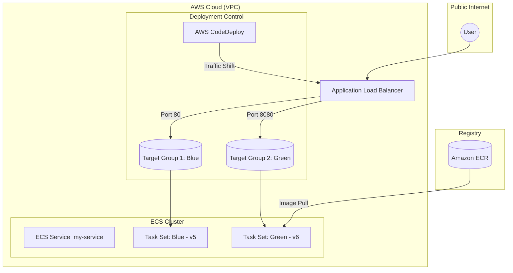

# AWS ECS Blue/Green Deployment Lab 🚀

This project demonstrates a production-grade CI/CD workflow for containerized applications using **Amazon ECS (Fargate)** and **AWS CodeDeploy**.

## 📐 Architecture Diagram
The following diagram represents the cloud infrastructure and deployment flow:



## ✅ Deployment Validation & Logs
*Note: Infrastructure was decommissioned post-testing for cost optimization.*

### 1. Verifying Running Tasks
```bash
$ aws ecs list-tasks --cluster ecs-cluster --service-name my-service --desired-status RUNNING
{
    "taskArns": [
        "arn:aws:ecs:us-east-1:582726398736:task/ecs-cluster/e1c4d47f494643938a0a5b7eddb03910"
    ]
}
```

---
**Author:** [Adetunji Mathew Babatunde](http://www.linkedin.com)
**Certifications:** AWS SAA, AWS DVA, AWS AI Practitioner.
